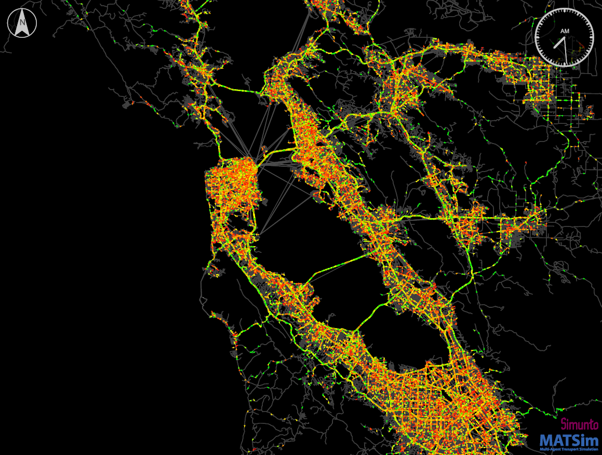

# An open synthetic population of California

This repository contains the code to create an open data synthetic travel demand
for any region in California. 

- [How to use this pipeline to create your own scenario](docs/howto.md)
- [How to run a MATSim transport simulation for San Francisco nine-county area](docs/howto.md)
- [How to run a MATSim transport simulation for Los Angeles five-county area](docs/howto.md)

## Main reference

The main research reference for the general pipeline methodology is:
> Hörl, S. and M. Balac (2020) [Reproducible scenarios for agent-based transport simulation: A case study for Paris and Île-​de-France](https://www.researchgate.net/publication/341131284_Reproducible_scenarios_for_agent-based_transport_simulation_A_case_study_for_Paris_and_Ile-de-France), Arbeitsberichte Verkehrs-und Raumplanung, 1499, IVT, ETH Zurich, Zurich.

The main research reference for the California synthetic travel demand is:
> M. Balac and S. Hörl (2021) [Synthetic population for the state of California based on open-data: examples of San Francisco Bay area and San Diego County](), presented at the 100th Annual Meeting of the Transportation Research Board.

## What is this?

This repository contains the code to create an open data synthetic travel demand
for any region in California.
It takes as input several publicly
available data sources to create a data set that closely represents the
socio-demographic attributes of persons and households in the region, as well
as their daily mobility patterns. Those mobility patterns consist of activities
which are performed at certain locations (like work, education, shopping, ...)
and which are connected by trips with a certain mode of transport. It is known
when and where these activities happen.

Such a synthetic population is useful for many research and planning applications.
Most notably, such a synthetic population serves as input to agent-based
**transport simulations**, which simulate the daily mobility behaviour of people
on a spatially and temporally detailed scale. Moreover, such data has been used
to study the **spreading of diseases**, or the **placement of services** and facilities.

The synthetic travel demand for California can be generated from scratch by
everybody who has basic knowledge in using Python. Detailed [instructions
on how to generate a synthetic population with this repository](docs/howto.md) are available.

Although the travel demand is independent of the downstream application
or simulation tool, we provide the means to create an input population for the
agent- and activity-based transport simulation framework [MATSim](https://matsim.org/).

This pipeline has been adapted to many other regions and cities around the world
and is under constant development. It is released under the GPL license, so feel free
to make adaptations, contributions or forks as long as you keep your code open
as well!

## Built scenarios
In case you want to use the synthetic travel demand directly without building them yourself, already built scenarios exist for Los Angeles, San Francisco and San Diego. Those can be found here:
- [San Francisco](https://polybox.ethz.ch/index.php/s/tnHThY2i3tTqeRx)
- [Los Angeles]() will arrive soon...
- [San Diego]() will arrive soon...

Ready to use 1pct agent-based models can also be found here:
- [San Francisco](https://polybox.ethz.ch/index.php/s/TGK5jkv6WoNy0t0) and can be run with the RunSimulation class avaialble [here](https://github.com/eqasim-org/eqasim-java/blob/develop/san_francisco/src/main/java/org/eqasim/san_francisco/RunSimulation.java)
- [Los Angeles]() will arrive soon... and can be run with the SunSimulation class available [here](https://github.com/eqasim-org/eqasim-java/blob/develop/los_angeles/src/main/java/org/eqasim/los_angeles/RunSimulation.java)

## Publications
- M. Balac and S. Hörl (2021) [Synthetic population for the state of California based on open-data: examples of San Francisco Bay area and San Diego County](https://www.researchgate.net/publication/349177186_Synthetic_population_for_the_state_of_California_based_on_open_data_Examples_of_the_San_Francisco_Bay_Area_and_San_Diego_County?_sg=ECrNv4QFH_5KZql4dflRlVSz0LgdLkTSzYI9-e4gNsgbeUkbrRCEMKyoLFyrUlchKkEvB79tIlRjhp1gLpmt9rTQZ-CbDl6o6fLEwIq7.a8M5mg06qzFW1ZGcHJ7zGzOgdjo-7not0S0V0T0lBuTrN4E8yDQqTLLa34JMukXJO3noNs3O6dWoHA-78sabiA), presented at the 100th Annual Meeting of the Transportation Research Board.
- Hörl, S. and M. Balac (2020) [Reproducible scenarios for agent-based transport simulation: A case study for Paris and Île-de-France](https://www.researchgate.net/publication/341131284_Reproducible_scenarios_for_agent-based_transport_simulation_A_case_study_for_Paris_and_Ile-de-France), Preprint, IVT, ETH Zurich, Zurich.
- Hörl, S., Balac, M. and Axhausen, K.W. (2019) [Dynamic demand estimation for an AMoD system in Paris](https://ieeexplore.ieee.org/document/8814051),
paper presented at the 30th IEEE Intelligent Vehicles Symposium, Paris, June 2019.
